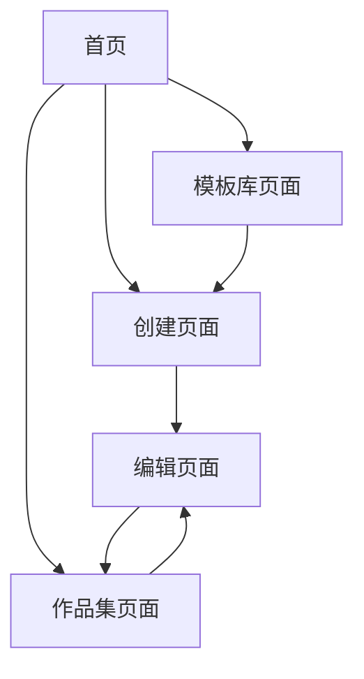

# Text2Card - 文本转卡片工具产品需求文档

## 1. 产品概述

Text2Card 是一个智能文本转卡片工具，帮助用户将长文本、网页链接或文档快速转换为精美的可视化卡片。
- 解决信息过载问题，将复杂内容提炼为易于理解和分享的卡片形式
- 面向内容创作者、学习者、知识工作者等需要信息整理和可视化的用户群体
- 提供AI智能分析、多样化模板和便捷的导出分享功能，提升信息处理效率

## 2. 核心功能

### 2.1 用户角色
本产品采用单一用户模式，无需复杂的角色区分：

| 角色 | 注册方式 | 核心权限 |
|------|----------|----------|
| 默认用户 | 无需注册，直接使用 | 可使用所有功能：创建卡片、编辑样式、导出分享 |

### 2.2 功能模块

我们的文本转卡片工具包含以下核心页面：
1. **首页**：产品介绍、快速开始入口、最近卡片展示
2. **创建页面**：文本输入、AI分析、模板选择、实时预览
3. **编辑页面**：卡片样式编辑、内容修改、预览模式
4. **作品集页面**：卡片管理、搜索筛选、批量操作
5. **模板库页面**：模板浏览、预览、应用

### 2.3 页面详情

| 页面名称 | 模块名称 | 功能描述 |
|----------|----------|----------|
| 首页 | 产品介绍区 | 展示产品特色和价值主张，引导用户开始使用 |
| 首页 | 快速开始 | 提供文本输入框，支持一键创建卡片 |
| 首页 | 最近卡片 | 显示用户最近创建的卡片，支持快速访问 |
| 创建页面 | 内容输入 | 支持文本输入、网页链接解析、文件上传（TXT/PDF/Word） |
| 创建页面 | AI分析 | 智能提取标题、摘要、关键词，生成结构化内容 |
| 创建页面 | 模板选择 | 提供多种预设模板，支持实时预览效果 |
| 创建页面 | 卡片预览 | 实时显示卡片效果，支持基础样式调整 |
| 编辑页面 | 内容编辑 | 修改卡片标题、摘要、正文内容 |
| 编辑页面 | 样式编辑 | 调整字体、颜色、布局、阴影等视觉效果 |
| 编辑页面 | 模板切换 | 更换卡片模板，保持内容不变 |
| 编辑页面 | 预览模式 | 全屏预览卡片效果，模拟最终展示 |
| 作品集页面 | 卡片列表 | 展示所有创建的卡片，支持网格和列表视图 |
| 作品集页面 | 搜索筛选 | 按标题、标签、创建时间等条件筛选卡片 |
| 作品集页面 | 批量操作 | 支持批量删除、导出、标签管理 |
| 模板库页面 | 模板展示 | 分类展示所有可用模板，支持预览 |
| 模板库页面 | 模板应用 | 选择模板后跳转到创建页面应用 |

## 3. 核心流程

### 主要用户操作流程：

**创建卡片流程：**
用户进入首页 → 点击创建卡片 → 输入文本/链接/上传文件 → AI分析内容 → 选择模板 → 预览卡片 → 保存/导出

**编辑卡片流程：**
用户在作品集选择卡片 → 进入编辑页面 → 修改内容/样式 → 实时预览 → 保存更改

**管理卡片流程：**
用户进入作品集 → 浏览/搜索卡片 → 选择操作（编辑/删除/导出/分享）

## 4. 用户界面设计

### 4.1 设计风格

- **主色调：** 蓝色系 (#3B82F6) 传达专业和信任感，辅助色为灰色系 (#6B7280)
- **按钮样式：** 圆角设计 (8px)，支持悬停和点击状态反馈
- **字体：** 主要使用系统字体栈，中文优先使用苹方/微软雅黑，英文使用 Inter/Roboto
- **布局风格：** 卡片式布局，顶部导航栏，响应式设计
- **图标风格：** 使用 Heroicons 图标库，保持一致的线性风格

### 4.2 页面设计概览

| 页面名称 | 模块名称 | UI元素 |
|----------|----------|--------|
| 首页 | 导航栏 | 白色背景，蓝色Logo，右侧功能按钮，固定顶部 |
| 首页 | 英雄区 | 渐变背景，大标题，副标题，CTA按钮居中布局 |
| 首页 | 功能介绍 | 三栏网格布局，图标+标题+描述，卡片阴影效果 |
| 创建页面 | 步骤指示器 | 水平进度条，当前步骤高亮，已完成步骤显示勾选 |
| 创建页面 | 输入区域 | 标签页切换，文本框/文件上传区域，蓝色边框聚焦 |
| 创建页面 | 模板选择 | 网格布局，悬停放大效果，选中状态边框高亮 |
| 编辑页面 | 工具栏 | 顶部固定，按钮组合，保存状态指示 |
| 编辑页面 | 编辑面板 | 左侧编辑区，右侧预览区，分割线可拖拽调整 |
| 作品集页面 | 筛选栏 | 搜索框，筛选下拉菜单，视图切换按钮 |
| 作品集页面 | 卡片网格 | 响应式网格，悬停阴影效果，操作按钮显隐 |

### 4.3 响应式设计

产品采用移动优先的响应式设计策略：
- **桌面端 (≥1024px)：** 完整功能布局，侧边栏+主内容区
- **平板端 (768px-1023px)：** 适配触摸操作，调整按钮大小和间距
- **移动端 (<768px)：** 单栏布局，底部导航，优化触摸体验
- 支持触摸手势操作，如滑动切换、长按选择等